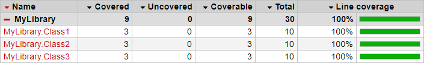

# CodeCoverageExample

Example of how to do code coverage on a .NET 5 project.\
The resulting [OpenCover](https://github.com/OpenCover/opencover) code coverage calculation can be used in SonarQube.\
[ReportGenerator](https://github.com/danielpalme/ReportGenerator) can optionally be used to create an Html report of code coverage (Cobertura output format).

## About

This example is based on https://github.com/wulfland/code-coverage-sample and [this article](https://writeabout.net/2019/04/27/net-core-code-coverage-done-right/).\
There is just one problem with the solution presented in the article - if you have more than one test project, test results are not merged.\
Only the last project for which the test is executed is taken into consideration when calculating code coverage.\
The example in this repository fixes that problem.

## How to run the example

To build the solution run:\
`dotnet build -c Release`

To calculate code coverage run:\
`dotnet test -c Release --logger trx --no-build /p:CollectCoverage=true /p:CoverletOutputFormat=opencover%2cjson /p:CoverletOutput=PATH_TO_CURRENT_DIRECTORY\coverage\ /p:MergeWith=PATH_TO_CURRENT_DIRECTORY\coverage\coverage.json /m:1`

Or simply execute [RunBuildAndCodeCoverage.ps1](./RunBuildAndCodeCoverage.ps1) to do both.

## How is the problem with the merging of code coverage results fixed

Compared with the original example/article, the following changes have been made:
- CoverletOutputFormat was changed from `opencover` to `opencover%2cjson`
  - merging is supported for json format, but not for opencover format
  - this is why we create both, do merging using json, and in the end produce both json and opencover
  - usage of `%2c` separator is explained [here](https://github.com/coverlet-coverage/coverlet/blob/master/Documentation/MSBuildIntegration.md#note-for-powershell--azure-devops-users)
- `/p:MergeWith` argument was added to merge code coverage results
- `/m:1` argument was added to force sequential execution of tests
  - this might not be needed, but is listed as needed [here](https://github.com/coverlet-coverage/coverlet/blob/master/Documentation/Examples/MSBuild/MergeWith/HowTo.md)

## Generating Html report from opencover.xml using ReportGenerator

Get [ReportGenerator](https://github.com/danielpalme/ReportGenerator) and in the folder where `coverage.opencover.xml` is located run:\
`.\reportgenerator "-reports:coverage.opencover.xml" "-targetdir:." "-reporttypes:Cobertura;HTMLInline;HTMLChart"`

In the generated Html we can see that code coverage is 100% :smiley:

    

